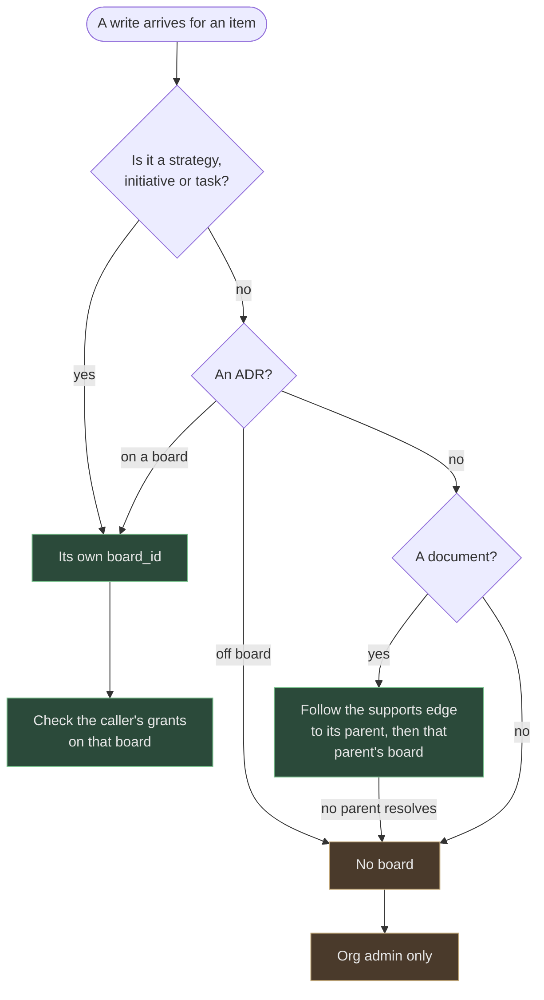

# Capabilities and access: why it is not roles

The first thing to know about authorisation in Kairos is what it is not. There
is no "team lead" role, no "coordinator" role, no "editor" that a user is made
into. There is nothing in the system that answers "what is this person?" — only
"what may this person do, on which board?"

That is not a stylistic preference. It is the decision that most of the rest of
the access model falls out of, and it is the one readers most often mistake for
an oversight.

## Read is open; write is a whitelist

Any member of an organisation can read any board, item or document in it.
Nothing needs granting for that.

This is a position, and it is worth stating as one: it follows from Flight
Levels rather than from a security analysis. The whole purpose of making work
visible on connected boards is coordination across team boundaries — a team
that cannot see what the initiative board is holding cannot tell whether its
own work is on the critical path. Read restrictions would undermine the thing
the product is for.

The consequence to accept knowingly is that **a board is not a confidentiality
boundary.** The tenant is. Each organisation gets its own PostgreSQL schema and
queries never cross it, so the hard boundary is real and it sits one level up
from where people often look for it. Work that genuinely must not be seen by
colleagues does not belong on a Kairos board.

Writes are the opposite: nothing is permitted unless something explicitly
permits it. A blacklist would have been less setup — users can do everything
until restricted — and was rejected for the usual reason, which is that "forgot
to deny" is a failure mode and "forgot to grant" is a support request. In a
system where strategic decisions move through board transitions, a user who
cannot transition a strategy will ask; a user who accidentally transitions one
will not.

## Capabilities are verbs on boards

A grant is a triple: this user, on this board, may do this. The capability
vocabulary is small and fixed — managing each family of items, transitioning
items between columns, configuring a board or templates or metadata, managing a
board's own membership — and it is
[enumerated in the decision](https://github.com/colliery-io/kairos/blob/main/.metis/adrs/KAIROS-A-0006.md)
that defines it rather than restated here. Glob patterns exist as a
convenience, so that granting everything on a board, or all the management
verbs, is one row rather than several. What matters for understanding the model
is that the patterns are the whole of the matching story: nothing else
intervenes between a grant and a decision, so there is no evaluation order to
hold in your head.

**Why the management capabilities are per board rather than global** is the
design decision a reader will otherwise read as an oversight, so it is worth
being explicit. A global "may manage initiatives" capability cannot be
restricted: a coordinator responsible for one initiative board would
automatically gain write access to every other one, and there would be no way
to express "admin here, read-only there" short of adding a second, negative
layer. Board-scoped grants cost more rows and a slightly more involved check;
what they buy is that the granularity matches how the organisation actually
works, because each board genuinely has its own owner and participants.

The alternative that looks most attractive from outside is a role per flight
level — leadership on strategy boards, coordinators on initiative boards, team
leads on delivery boards. It maps onto the default Flight Levels ownership
model exactly, and that is its problem: it hardcodes the assumption that every
strategy board in every tenant has the same access model. Kairos keeps those
named bundles as a convenience layer on top — a default set of grants that
makes a new coordinator's board usable — rather than as part of the
authorisation model. The distinction matters when an organisation needs
something the defaults do not describe: it customises grants, it does not have
to fight a role.

The practical payoff of having no roles is that "what can this person do?" is
answered by listing their grants. There is no inheritance to trace, no global
layer to check afterwards, and an audit is a query.

## The three things that are implied rather than granted

A pure whitelist would be unusable, and three implications keep it honest. Each
is *computed* at check time rather than stored as rows, which is the shared
design idea worth pulling out: nothing needs syncing, and nothing can drift.

**Organisation admins bypass everything.** This is the only role-shaped thing
in the system, and it is acknowledged as an escape hatch — the kind that gets
overused because it always works. It exists because tenant-wide configuration
has to belong to somebody.

**Membership of a board's owning team implies the day-to-day delivery set.**
The implied verbs are the ones a team member uses to do their own work, and the
boundary is drawn deliberately short of anything that changes how the board
itself behaves or who else may use it — so configuration and membership stay
explicit grants, as do the management families belonging to the levels above
delivery. The decision record has the exact set; the shape of it is the part
worth knowing, because it explains why this implication is safe to hand out
automatically and a broader one would not be.

The amendment came directly out of user-acceptance testing, which found that a
team member could not work their own team's delivery board until an admin
hand-granted capabilities per member per board. "Join the team, work the team's
board" is what everyone expects, and the expectation was right.

Two other ways to deliver it were rejected. Auto-granting real rows when
someone joins a team is the obvious implementation and creates a revocation
problem: once an admin has customised the grants, nobody can tell which rows
came from membership and which were deliberate. Keeping the pure whitelist and
seeding defaults leaves the onboarding chore in place. Computing the
implication means leaving the team *is* the revocation, and explicit grants
keep their own audit story untouched.

**Every member may send a request to any team.** A member who does not manage
a delivery board may still create a task on it, and that task is a request: it
goes to the board's entry column, as support work, and the receiving team
decides what happens to it. This one is a deliberate widening of the whitelist
rather than a convenience: it is the only place where the model grants a write
nobody asked for, and it is narrowly bounded so that the receiving team's
triage remains the control point. [Repositories as execution
scope](repositories-as-execution-scope.md#requests-between-teams-are-support-work)
is where that widening is argued and its bounds described, because it exists
for the sake of coordination between teams.

## The person who made it may edit it

Everything above is about boards. One rule is about items, and it cuts across
the board model rather than extending it: **whoever created an item may edit
it**, with no capability on the board it sits on.

Creation is the primary mechanism of ownership. That is the position, and the
rest follows from taking it seriously. The person who wrote a task knows what
it was meant to say; if they cannot correct a wrong word in it, the system has
decided that a team's board matters more than the accuracy of what is on it.
A capability on a board is then best understood as how a team *shares* that
ownership — the means by which people who did not write an item come to be
trusted with it — rather than as the only source of it.

The rule arrived through a smaller question. A member who sends a request to
another team has no grant on that team's board, by construction, and so could
not fix the request they had just written, nor archive it when it turned out to
be a duplicate. An earlier amendment had let them *link* it, as a special case
for two relationship types and one end of the edge. The special cases were
multiplying, and each was a fragment of the same idea. Stating the idea once is
both the smaller rule and the more predictable one.

**What counts as an edit** is everything that changes what the item says or
whether it is in view: title and content, metadata, the repository a task
points at, a document's editorial lifecycle, archiving and restoring.
[Capabilities](../reference/capabilities.md#the-edit-rule) has the list against
the routes.

**What does not count is movement**, and this is the half to remember. Moving
an item between columns, changing its lane, and moving it to another board all
still require the capability on the board, and having created the item buys
nothing there. The reason is that movement is not a fact about the item. Where
a card sits on a team's board is a statement about that team's plan — what they
have accepted, what they are doing, what is done — and [a team controls its own
plan](repositories-as-execution-scope.md#requests-between-teams-are-support-work).
If authorship conferred movement, sending a request would be a way to schedule
another team's work, which is exactly what requests exist to prevent. So the
person who sends a request can sharpen it, link it and withdraw it, and cannot
pull it out of the entry column or into the planned lane.

The line is drawn where the two kinds of ownership stop overlapping: the author
owns what the item says; the team owns where it is.

Two consequences are worth accepting knowingly. The right follows the person,
not the placement, so it survives the item moving to a board its creator has
never had access to — a team that takes over a task also takes on its author as
someone who may edit it. And "what can this person do?" is no longer answered
by listing their grants alone: it is their grants, plus what they have made.
Both remain a query, which is the property that mattered.

Creation grants nothing else. It is not a capability, it cannot be granted or
revoked, and it confers no authority over any board, team, member or
configuration — nor over creating more items, which is gated exactly as before.

### Links follow from edits

Once "may edit" has one definition, the rule for relationships stops needing
its own: **whoever may edit the item at either end of an edge may write that
edge**, for every relationship type.

Either end, rather than both, because an edge is a statement about two items
that usually sit on two teams' boards, and a rule that required authority over
both would make cross-team links — the ones coordination depends on — the
hardest to write. One end is enough to have standing to say how your item
relates to something else.

Every type, rather than some, because the earlier split was an accident of
history rather than a judgement about risk. Relationships were once classed as
tenant-wide configuration and reserved to organisation admins; two types were
later carved out for members. The result was that someone who could rewrite an
ADR entirely could not record which ADR it superseded. Consistent behaviour is
the better experience, and nothing about `supports` or `supersedes` makes them
more dangerous to write than `blocks`.

The rule decides who may write an edge. Which edges can exist at all — the
type rules, the cycle check — is a property of the graph and is unchanged.

### The one edge that carries authority

There is one edge the rule is too generous for, and it is worth seeing why,
because it is the only place where writing an edge changes who may edit
something.

A document borrows its authority from what it supports. Its board is the board
of its earliest `supports` parent. So that one edge is not only a statement
about two items: it decides which team answers for the document. "Either end"
is the right rule for a statement and the wrong rule for a transfer.

Two things followed from the plain link rule. A document that supported
nothing had no team to answer for it, and the first person to attach it to
their own work took it: they could edit the source, the edge was the
document's first, and their board became its board. And a person who could
edit a document's earliest parent, but not the document, could remove that
edge and leave a later parent — perhaps their own — as the earliest.

So the rule narrows in exactly the places where the edge moves authority.
Attaching a document that has no parent needs the right to edit the document.
Removing a parent of a document needs the right to edit the document. And no
one, an organisation admin included, may remove a document's last parent: the
server does not create the state the first problem starts from. Adding a
parent to a document that already has one moves nothing, because the earliest
edge still wins, so it stays on the plain rule.

The way to move a document is therefore to attach it to the new item first and
detach it from the old one second. Someone who may edit the document may do
both, and in doing so gives its authority to another board, which is theirs to
give.

This is an interim shape. It keeps "authority from the parent's board" and
closes the two ways to take it. A list of editors per document would remove
the need for the edge to carry authority at all.

## Things that have no board of their own

Not everything sits on a board, and each case is resolved by asking what board
it *belongs* to rather than by inventing a new access surface.

**A document inherits its parent's board.** Documents are not free-floating
artifacts in Kairos; a document supports a workflow item, and that relationship
is how it is anchored. So editing a document that supports an initiative
requires write access on that initiative's board, or having written the
document. The alternative — giving
documents their own synthetic board context — would have created a second place
to grant access and a second place to get it wrong. The consequence worth
knowing is that a document's access changes if its parent moves, which is
correct and occasionally surprising — for everyone but its author, whose right
to edit it does not depend on where the parent is.

**Tenant-wide configuration is organisation-admin only.** Templates and
metadata definitions are not scoped to a board, so there is no board-scoped
answer to give. This is the case the org-admin bypass exists for. Individual
relationships used to be classed with them and no longer are: an edge belongs
to the two items it joins, and [is written by whoever may edit
one](#links-follow-from-edits).

## Resolving the board, as a chain

Every write asks the same question first — *which board governs this?* — and the
answer is a short lookup rather than a property of the user:

The amber path is the one worth remembering: **no board means org admin only.**
That is not a denial so much as a fallback, and it is why an off-board ADR and a
document nobody has attached to anything both behave like tenant-wide
configuration. The chain answers the board question only. For an edit, the
item's creator passes before the chain is consulted at all, so an off-board ADR
is editable by the admin who wrote it and by any other admin — and a document
with no parent is still editable by its author. The server no longer lets a
document lose its last parent, so such a document is old data; see [the one
edge that carries authority](#the-one-edge-that-carries-authority).

## Archived work is not less accessible

One rule holds across the whole model and is easy to get backwards: **whoever
could read work before it was put away can read it after.** Archiving is not a
permission boundary.

Implementing that turned out to require care rather than a new rule. Board
resolution used to consider only live items, so an archived item resolved to no
board at all — and with no board there were no board-scoped capabilities to
find, leaving only the tenant-wide admin policy. Serving archived work without
fixing that would have made archived work *more* restricted than live work,
which inverts the rule precisely. It is a good illustration of how a whitelist
fails: absence of a grant and absence of a subject look identical at the point
of the check.

[Archiving](archiving.md) covers the rest of what that state does and does not
mean.

## Where this comes from

- [Board-scoped capabilities, the whitelist stance, the capability vocabulary and
  the amendment that added team-implied
  capabilities](https://github.com/colliery-io/kairos/blob/main/.metis/adrs/KAIROS-A-0006.md)
  (KAIROS-A-0006).
- [Backlog filing as a computed, tenant-wide
  capability](https://github.com/colliery-io/kairos/blob/main/.metis/adrs/KAIROS-A-0019.md)
  (KAIROS-A-0019), amended by COLLIERY-A-0023: what a member files is a request,
  and it is support work.
- [Archiving is not a permission
  boundary](https://github.com/colliery-io/kairos/blob/main/.metis/adrs/KAIROS-A-0020.md)
  (KAIROS-A-0020).
- The edit rule and the link rule (COLLIERY-T-0228): creation is the primary
  mechanism of ownership, a link follows the same rule as an edit, and movement
  stays with the team of the board.
- A document always has a parent, and its `supports` edge is written by whoever
  may edit the document (COLLIERY-T-0235).

<!-- KAIROS-I-0016 / KAIROS-T-0171 (E6): the capability vocabulary and the
     computed grant sets are cited to KAIROS-A-0006 rather than restated here,
     because no reference page currently enumerates them. Recorded for
     KAIROS-T-0169/T-0175: a reference home for the capability surface is the
     right destination, and this page should cite that instead. -->
