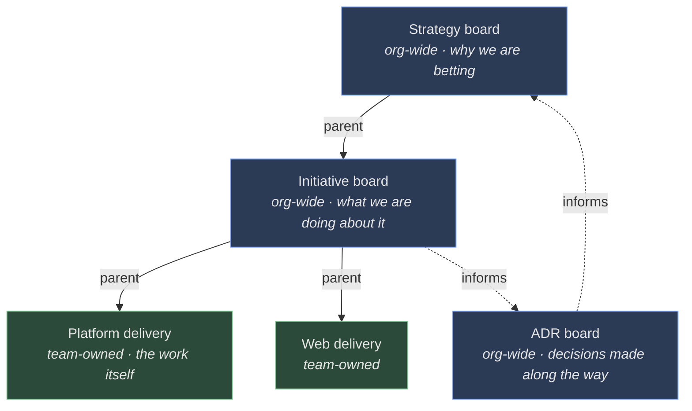

# Flight levels: why three boards and not one

Most work-tracking tools give an organisation one board and let it grow. Kairos
gives it three, at three different altitudes, and connects them. This page is
about why — what each level is for, why direction travels down it while
information travels up, and why the boards themselves are data rather than
code.

## The problem one board cannot solve

A single board has to hold one kind of card. That is fine until the cards start
disagreeing about what "done" means.

A leadership bet — "we believe that if we do X, Y will happen" — is not done
when someone merges a pull request. It is done when the hypothesis has been
watched long enough to be confirmed or abandoned, which may be a quarter after
the last commit. A cross-team project is not done when its first team finishes;
it is done when the last one does and the thing works end to end. A ticket in a
team's queue is done when the work is merged and the team says so.

Those three things also have different owners, different cadences, and
different decision rights. Leadership decides which bets the organisation is
making. A coordinator decides which projects are in flight and where capacity
is going. A team decides how it works. Flattening them onto one board means one
of two outcomes: either the strategic cards sit untouched for months among
tickets that move daily, or the tickets get dragged into a ceremony designed
for bets.

Flight Levels, as a way of looking at an organisation, is not a Kairos
invention — it is Klaus Leopold's framing, and its central claim is that
improving each team's own board does not by itself improve the flow of value
through the organisation, because the interesting delays live *between* teams.
Kairos takes that literally: the coordination layer gets its own board, with
its own cards, rather than being a report assembled from the teams' boards.

## What each level is for

**Strategy** is one board, owned by leadership, and it holds bets. A strategy
is framed as a hypothesis on purpose: "we're doing X because we believe Y will
happen". The framing is a constraint on the author, and it is the reason the
strategy board has a phase *after* the work is finished — a hypothesis that
nobody ever checks is a wish. The company vision informs this board without
living on it; every strategy is evaluated against it.

**Initiative** is the coordination layer, a small number of boards each owned
by a coordinator, holding concrete projects that deliver against strategies.
This is where capacity is understood at the macro level and where work is
shaped before it reaches a team: a project spends time in discovery and design,
becomes ready, and is decomposed into delivery work only when a team is
actually going to pull it. Like the strategy level it has a phase after
delivery, because stabilisation is real and pretending a project ends at the
last merge is how support work becomes invisible. The social contract — the
shared agreements between teams about communication and commitments — informs
this level.

Two things at this level are worth knowing about because they look like
irregularities. **Bucket initiatives** are standing initiatives for tech debt,
bugs and ad-hoc requests: they exist so that the capacity spent on non-project
work is visible as a quantity rather than as an absence, and they are recreated
at whatever cadence an organisation uses rather than running forever. And
initiatives are where cross-repository intent lives, which is why they never
bind to a repository the way tasks do (see [repositories as execution
scope](repositories-as-execution-scope.md)).

**Delivery** is one board per team, owned by the team, holding tasks, bugs and
tech debt — and what that ownership entails, including why a team is hard to
disband, is [its own topic](teams-and-boards.md). Teams are deliberately left
alone at this level: the only requirement Kairos imposes is that work is
trackable and linked upward, so flow is visible across levels. The team charter
informs this board. Work arrives from two directions —
decomposed from an initiative, or raised by the team itself — and both are
first-class, because a model that only admits top-down work makes every bug an
exception.

The column sequence each level's boards are seeded with is set out in
[the decision that made columns
configurable](https://github.com/colliery-io/kairos/blob/main/.metis/adrs/KAIROS-A-0002.md);
the shapes differ because the levels differ, not because anything is being kept
consistent for its own sake.

## The shape, in one picture

The solid edges are `parent`: strategy decomposes into initiatives, an
initiative decomposes into work on one or more delivery boards. The dotted ones
are `informs`, which carries no decomposition — an ADR is not part of the work,
it is a decision the work produced.

Note which boards are team-owned. Only delivery is; the two upper levels and
the ADR board belong to the organisation, which is the structural claim this
page is making.

## Down and up

Direction flows down. A strategy explains what the organisation is building
toward; initiatives are created to implement active strategies; tasks are
decomposed from initiatives. Information flows up: teams surface progress and
blockers at the coordination level, coordinators surface project status at the
strategy level, and escalations and proposals travel the same way.

That is a statement about ceremonies, but it is also a statement about the
data. The levels are not three separate applications with a reporting job
between them; they are one graph. Hierarchy is an edge — a `parent`
relationship between two items — and so are the other connections that matter:
a document that supports an initiative, a charter that informs a board, an ADR
that supersedes another, a task that blocks a task. All of them live in one
relationship table rather than in columns on the entities, which is what lets a
new relationship type appear without touching any entity, and what makes "every
task under this strategy" a single recursive walk regardless of how deep the
tree is.

The alternative Kairos came from is worth naming, because it shaped the
decision. Metis, its predecessor, kept every document in one polymorphic table
with type-specific fields in JSON. That works for a single repository's worth
of files and stops working when the schema has to be the thing that enforces
correctness. Separate tables per entity type cost more tables and a UUID space
shared across them; what they buy is a schema that describes itself and a
database that can refuse bad data on its own.

Rolling *up* through that graph is where one subtlety lives. An item's
relationship list and its progress rollup answer different questions, and they
disagree about archived work on purpose: containment is a fact about the
record, progress is a fact about live work. [Archiving](archiving.md) explains
why.

## Why the boards are configurable

A level's phases could have been an enum in the code. Metis did exactly that,
and adding a phase meant a code change and a migration. For a multi-tenant
system that is untenable — a startup and an enterprise do not want the same
ceremony, and even inside one organisation a platform team's board and a
stream-aligned team's board legitimately differ.

So boards are first-class entities: columns are rows, and a transition is a row
too. Moving an item from one column to another is allowed if a matching
transition exists and refused if it does not. The important consequence is that
**column order does not imply permission to move.** Position exists for
display, left to right; the transitions are a separate set of facts. A board
can be linear, can allow a step backwards when scope changes, can have a
column that everything escapes to and nothing flows through.

Two simpler designs were considered and rejected, and the reasons are the
useful part. Hardcoded phase enums are the cheapest thing that works and give
compile-time safety, but they force one workflow on every tenant. Ordered
columns with forward-only movement plus a "blocked" escape hatch are nearly as
cheap and cover most real boards — but "nearly" is doing a lot of work there,
and once a board needs a non-linear path there is nowhere to put it. Explicit
transition rules cost more tables and turn a compile-time check into a database
lookup; in exchange, any workflow shape is expressible and none of them require
a deployment.

The cost is real and worth stating: a board can be configured into a dead end —
a column with no way out — and nothing in the schema prevents it. Metrics and
reporting have to be column-aware rather than assuming a fixed set of phases.
Defaults absorb most of this, because most boards never get customised, but the
sharp edge exists and is the price of the flexibility.

## Where this comes from

- [Configurable board columns and transitions, and the alternatives weighed
  against them](https://github.com/colliery-io/kairos/blob/main/.metis/adrs/KAIROS-A-0002.md)
  (KAIROS-A-0002).
- [The entity model and the single relationship
  graph](https://github.com/colliery-io/kairos/blob/main/.metis/adrs/KAIROS-A-0001.md)
  (KAIROS-A-0001).
- [What each level is for, its ownership and its
  ceremonies](https://github.com/colliery-io/kairos/blob/main/.metis/vision.md)
  (KAIROS-V-0001).

<!-- KAIROS-I-0016 / KAIROS-T-0171: the per-level default column sequences have
     no reference home yet, so they are cited to KAIROS-A-0002. Recorded for
     KAIROS-T-0169/T-0175: reference/rest/boards-and-teams.md says a board is
     seeded with its level's defaults without listing them. -->
